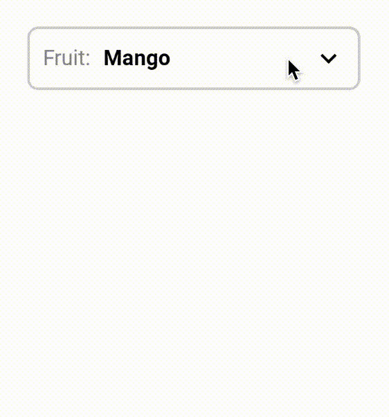
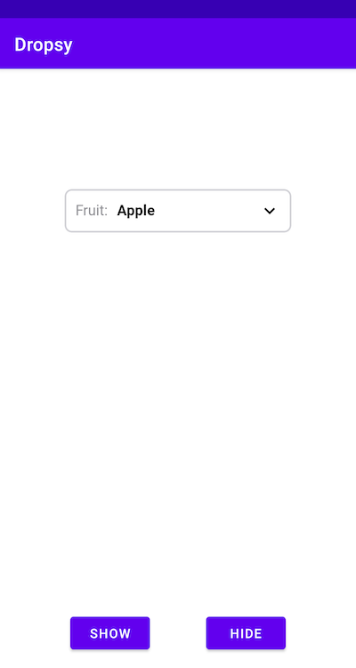

# Dropsy
Simple dropdown/spinner view for Android.

<kbd>
    
</kbd>

## Usage
:point_right: Add the Dropsy's `DropDownView` view in XML layout like this:
```xml
<com.qandeelabbassi.dropsy.DropDownView
    android:id="@+id/dropdown_fruits"
    android:layout_width="250dp"
    android:layout_height="wrap_content"
    app:dropsyElevation="@dimen/drop_down_elevation"
    app:dropsyItems="@array/dropdown_items"
    app:dropsyLabel="@string/dropdown_label"
    app:dropsySelector="@color/dropsy_selector"
    app:dropsyLabelColor="@color/dropsy_text_color_secondary"
    app:dropsyValueColor="@color/dropsy_text_color" />
```
:point_right: Set a listener on the `DropDownView` in your Activity/Fragment like this:
```kotlin
class MainActivity : AppCompatActivity() {
    override fun onCreate(savedInstanceState: Bundle?) {
        super.onCreate(savedInstanceState)
        setContentView(R.layout.activity_main)
        // set listener
        findViewById<DropDownView>(R.id.dropdown_fruits).setItemClickListener { i, item ->
            Toast.makeText(this, "${item.text} clicked at index $i", Toast.LENGTH_SHORT).show()
        }
    }
}
```
:point_right: To programmatically show/hide the dropdown you can use `showDropdown()`/`hideDropdown()`:
```kotlin
btn_show.setOnClickListener { dropdown_fruits.showDropdown() }
btn_hide.setOnClickListener { dropdown_fruits.hideDropdown() }
```

## Sample App Screenshot:

